# Mini Project: Creating Subnets on AWS Management Console

## Purpose
In this mini project, you will learn how to create subnets within a Virtual Private Cloud (VPC) on AWS using the AWS Management Console. The project will guide you through the process of defining subnets and configuring their basic settings.

## Objectives
1. Learn how to create public and private subnets within an existing VPC.
2. Enable Auto-assign Public IP for the Public Subnet

## Project Tasks
### Task 1: Create Public Subnet
- Log in to the AWS Management Console
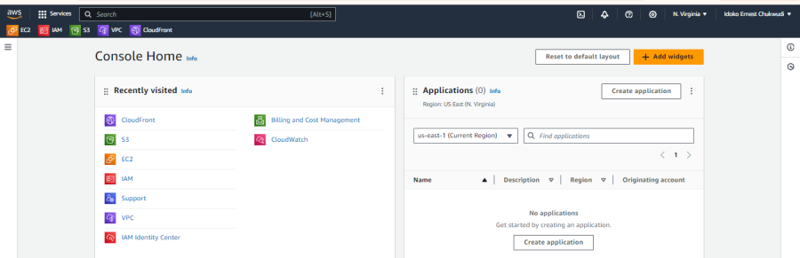

- Navigate to the VPC Dashboard
In the AWS Management Console, type "VPC" in the search bar at the top and select "VPC" from the dropdown list.
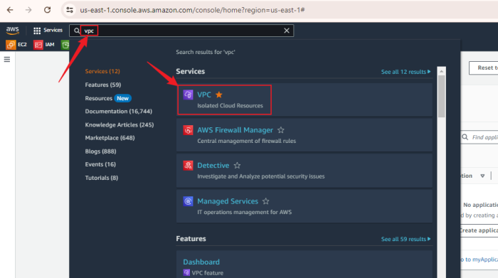

- Access the Subnets Section
In the VPC Dashboard, click on "Subnets" in the left navigation pane.
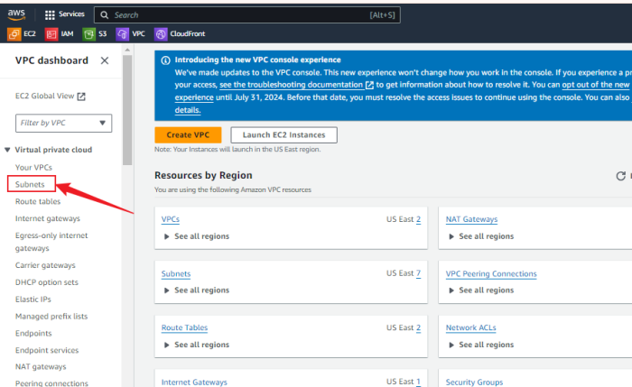

- Click the "Create subnet" Button
Click the "Create subnet" button at the top right of the Subnets page.
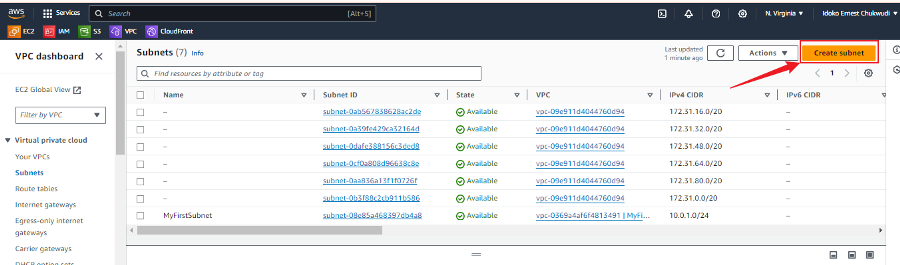

- VPC: Select the VPC where you want to create the subnet.
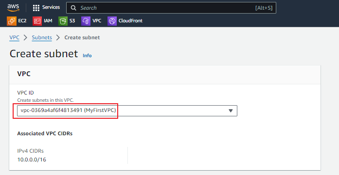

- Fill in the other Subnet Details for the Public Subnet
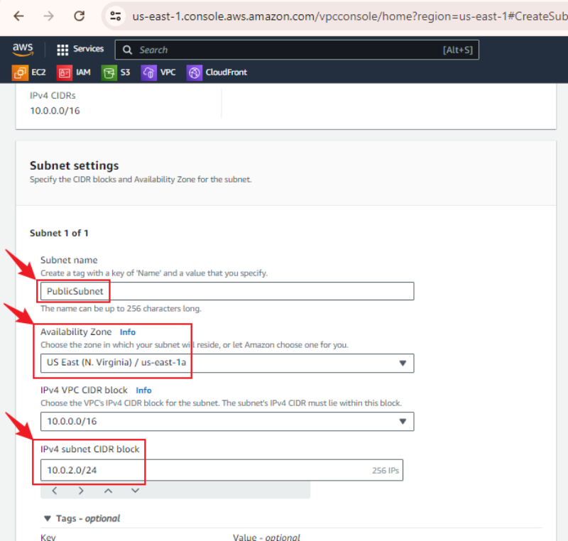

- Create the Public Subnet
After filling in the details, click the "Create subnet" button at the bottom right corner of the page.
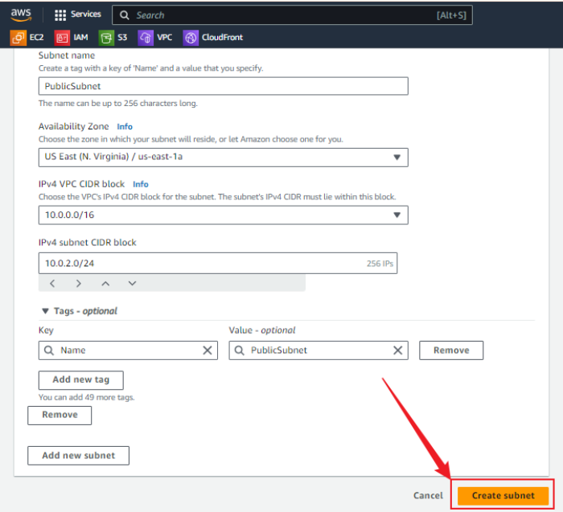

- Confirm Subnet Creation
You should see a confirmation message that your public subnet has been created successfully.
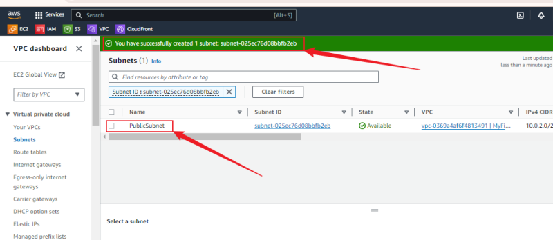

## Task 2: Create Private Subnet
- Click the "Create subnet" button at the top right of the Subnets page.
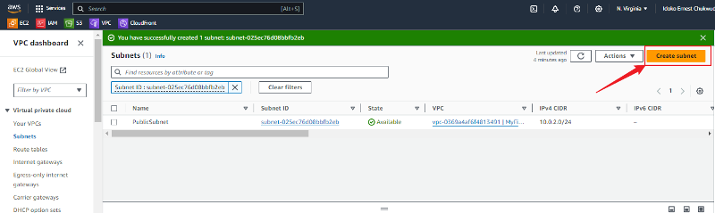

- Enter a name for your private subnet (e.g., "PrivateSubnet").
- Select the same VPC where you created the public subnet.
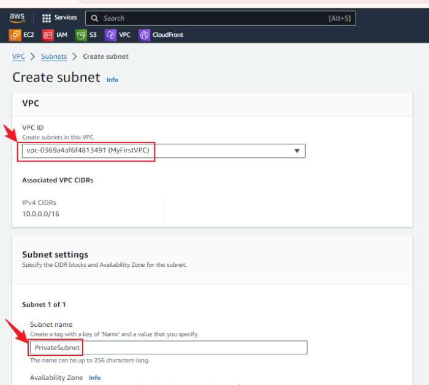

- Fill in other Subnet Details for the Private Subnet
- After filling in the details, click the "Create subnet" button at the bottom right corner of the page.
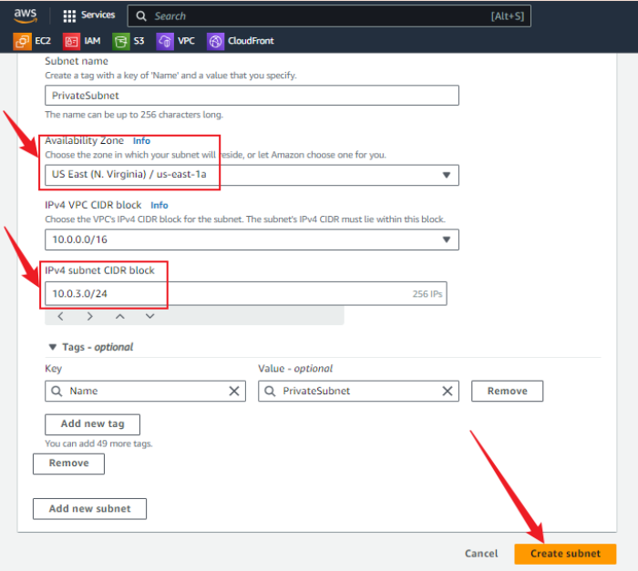

- Confirm Subnet Creation:
You should see a confirmation message that your private subnet has been created successfully.
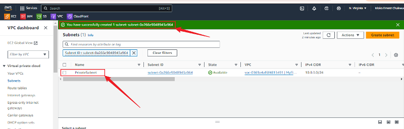

## Task 3: Verify Subnet Creation
- Verify Subnet Details:
Ensure both the public and private subnets are listed with the correct CIDR blocks and availability zones.
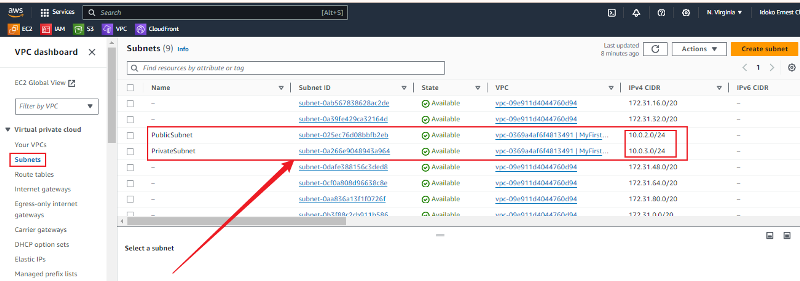
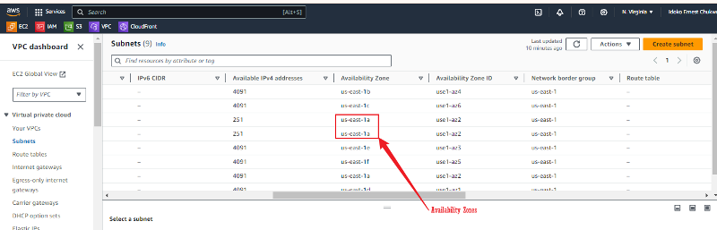

## Enabling Auto-assign Public IP for the Public Subnet
In addition, you will make sure that the "Auto-assign public IP" setting is enabled for the public subnet and disabled for the private subnet.

### Steps to Enable Auto-assign Public IP:
- Step 1: Verify the status of the Auto-assign Public IP.
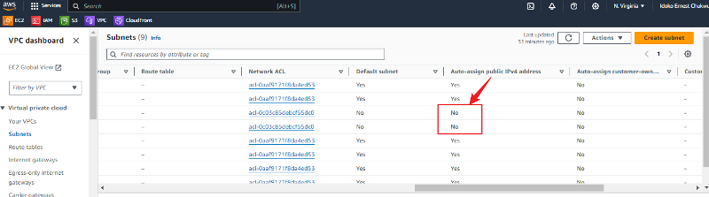

- Step 2: Click on the Public-Subnet-ID:
Select the subnet that you designated as the public subnet from the list.
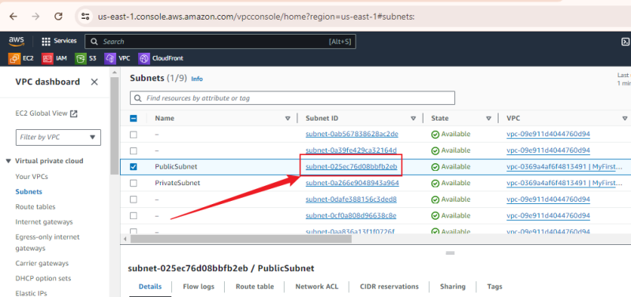

- Step 3: Click on the "Actions" button and choose "Edit subnet settings" from the dropdown.
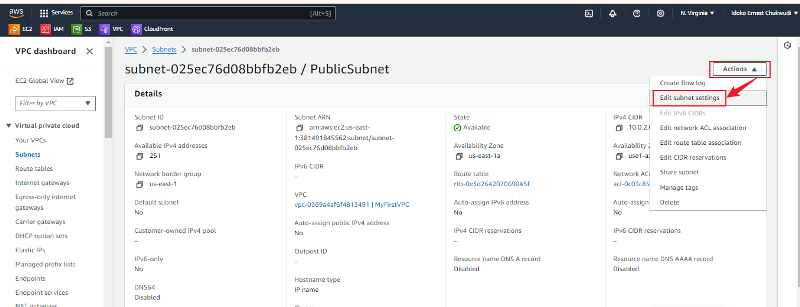

- Step 4: Check the Auto-assign public IPv4 address box and click on Save
- Ensure the "Auto-assign public IPv4 address" checkbox is checked.
- Click the "Save" button to apply the changes.
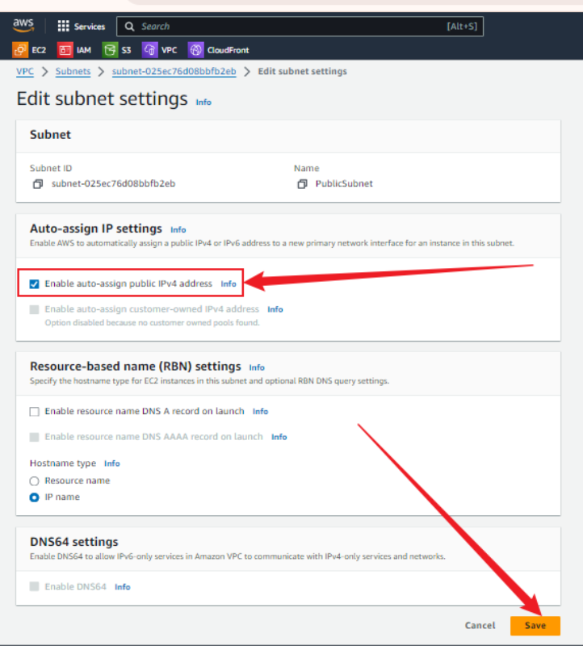

- Step 5: Verify Auto-assign Public IP
- Verify that the "Auto-assign public IP" is enabled for the public subnet and disabled for the private subnet.
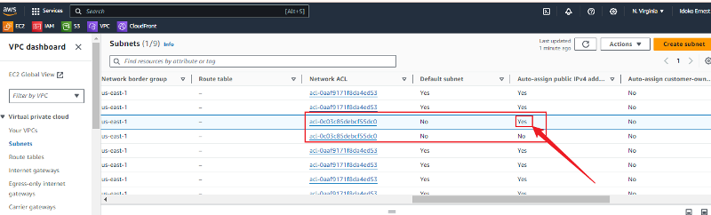

## Conclusion
In this mini project, I have successfully learned how to create and configure subnets within a Virtual Private Cloud (VPC) on AWS using the AWS Management Console. The project guided me through defining `public and private subnets` and configuring their basic settings, including enabling `auto-assign public IP` for the public subnet.

Subnets play a crucial role in network segmentation within a VPC by dividing the network into smaller, more manageable sections. This segmentation enhances security, improves network performance, and simplifies management. In this project, I set up a public subnet, which allows instances within it to communicate directly with the internet, and a private subnet, which isolates instances from direct internet access for enhanced security.

The basic configurations needed to set up public and private subnets include:

1. **Creating the Subnet:** Define the subnet within the VPC by specifying the VPC ID, subnet name, CIDR block, and availability zone.
2. **Configuring IP Settings:** Enable auto-assign public IP for the public subnet to ensure instances can access the internet.
3. **Verifying Subnet Details:** Confirm that both subnets are correctly listed with the appropriate CIDR blocks and availability zones.

By following these steps, I have laid the groundwork for a secure and well-organized VPC infrastructure, capable of supporting various applications and workloads in AWS. This knowledge is fundamental for effectively managing and deploying resources in the cloud.